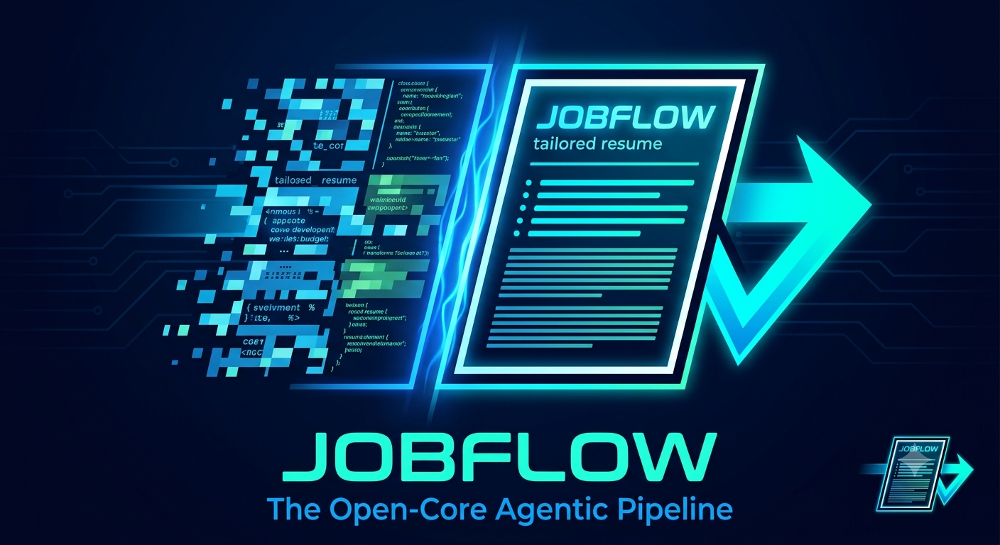

# JOBFLOW

> **The open-core agentic pipeline for job applications.**
> Capture a job posting from any tab, get a tailored one-page resume + a CSV tracker — all running locally on your machine.

<p align="center">
  
</p>

---

## What it does

You're on a job posting in your browser. You click the JOBFLOW Chrome extension. A few seconds later, a tailored one-page resume PDF is sitting in your output folder, the application appears in your tracker dashboard, and you're ready to submit.

Under the hood, JOBFLOW orchestrates four pieces:

1. **Chrome extension** — captures the JD text and URL with one click.
2. **Local server** — receives captures into a CSV queue, serves a dashboard at `http://localhost:3737/`.
3. **Sealed blueprints** — five archetype-specific resume templates (AdTech, Data Infra, Strategy/Growth, Regulated SaaS, AI Founder). One blueprint per JD, surgical ATS keyword overrides only — never rewritten.
4. **Claude Code skills** — `/process-queue` picks the right blueprint, generates the `.docx` + `.pdf` with a mandatory QA gate (page count = 1, Skills row line-wrap, font/margin checks). `/answer-questions` tailors application-form answers from your `answer_bank.md`.

All data lives on your disk. The server binds to `127.0.0.1` only. Nothing leaves your machine.

---

## Architecture

```
┌──────────────────┐  POST  ┌────────────────────┐  append  ┌───────────────────┐
│ Chrome extension │ ─────▶ │ Local Node server  │ ───────▶ │ user_data/        │
│   "Queue Job"    │ :3737  │ (LaunchAgent)      │          │   queue.csv       │
└──────────────────┘        └────────────────────┘          └───────────────────┘
                                       │                              │
                                       ▼                              ▼
                            ┌────────────────────┐         ┌───────────────────┐
                            │ Dashboard          │         │ Claude Code       │
                            │ localhost:3737/    │◀────────│ /process-queue    │
                            │ (sort, filter,     │  reads  │ /answer-questions │
                            │  outcomes, Q&A)    │         └───────────────────┘
                            └────────────────────┘                  │
                                                                    ▼
                                                       ┌───────────────────────┐
                                                       │ One-page tailored PDF │
                                                       │ + QA gate (LibreOffice│
                                                       │  page count, line wrap│
                                                       │  font/margins)        │
                                                       └───────────────────────┘
```

See [docs/server.md](docs/server.md) for the server operations reference.

---

## Repository layout

```
jobflow/
├── .claude/skills/             # The 3 Claude Code skills (project-scoped)
│   ├── resume-builder/         # Single-JD pipeline (when you paste a JD directly)
│   ├── process-queue/          # Batch-process pending queue rows
│   └── answer-questions/       # Tailor application-form answers
├── server.js                   # The local capture server (no deps, native Node)
├── qa_resume.js                # PDF QA gate: 1 page, Skills line, font, margins
├── extension/                  # Chrome extension (MV3) source
│   ├── manifest.json
│   ├── popup.html / popup.js
│   └── icon.png
├── blueprints/                 # OPEN-SOURCE: archetype templates + sample
│   ├── _schema.md              # The canonical blueprint structure
│   ├── _archetype_*.md         # 5 empty scaffolds with section guidance
│   └── sample/                 # Filled-in example so you see what one looks like
│       └── blueprint_strategy_growth_sample.md
├── docs/
│   ├── server.md               # Server operations reference
│   └── roadmap.md              # Open-core, autonomous-submit, multi-tenant vision
├── launchd/
│   └── com.jobflow.server.plist.template
├── assets/
│   └── logo.png
├── user_data/                  # GITIGNORED — your personal data lives here
│   ├── blueprints/             #   your 5 filled-in blueprints
│   ├── answer_bank.md          #   your factual answer canon
│   └── queue.csv               #   captured JDs + status tracker
├── LICENSE                     # AGPL-3.0
├── CONTRIBUTING.md
├── CHANGELOG.md
└── README.md
```

---

## Quick start

### Prerequisites

| | Tested with |
|---|---|
| macOS | 14+ (Sonoma) |
| Node.js | 20 LTS or newer |
| Claude Code Desktop | 2.1.72+ |
| Homebrew | Any recent version |
| LibreOffice | Any recent version (used for the PDF QA gate) |
| Google Chrome | Any recent version |

### 1. Clone and install dependencies

```bash
git clone https://github.com/<your-username>/jobflow.git ~/jobflow
cd ~/jobflow

# LibreOffice is the only system dep (used by qa_resume.js to convert .docx → .pdf)
brew install --cask libreoffice
brew install poppler  # provides pdfinfo + pdftotext for QA checks

# Node deps (only the `docx` package is needed)
npm install --global docx@9
```

### 2. Set up your blueprints + answer bank

In Claude Code, run the interview skill *(coming soon — `/interview-canon`)*. It walks you through ~20 questions and generates `user_data/blueprints/*.md` and `user_data/answer_bank.md`.

**Until that skill ships:** copy the archetype scaffolds and fill them in by hand.

```bash
mkdir -p user_data/blueprints
cp blueprints/_archetype_adtech.md          user_data/blueprints/blueprint_adtech.md
cp blueprints/_archetype_data_infra.md      user_data/blueprints/blueprint_data_infra.md
cp blueprints/_archetype_strategy_growth.md user_data/blueprints/blueprint_strategy_growth.md
cp blueprints/_archetype_regulated_saas.md  user_data/blueprints/blueprint_regulated_saas.md
cp blueprints/_archetype_ai_founder.md      user_data/blueprints/blueprint_ai_founder.md

# Then edit each file to reflect your actual career, archetype by archetype.
# See blueprints/sample/blueprint_strategy_growth_sample.md for a worked example.
```

Then create your `user_data/answer_bank.md` — same idea, copy the structure from the example in [docs/](docs/) and fill in your salary anchors, notice period, references, etc.

### 3. Install the server as a LaunchAgent

```bash
# Personalize the plist template with your username + path
sed -e "s|{{USER}}|$USER|g" -e "s|{{JOBFLOW_HOME}}|$HOME/jobflow|g" \
  launchd/com.jobflow.server.plist.template \
  > ~/Library/LaunchAgents/com.jobflow.server.plist

launchctl load ~/Library/LaunchAgents/com.jobflow.server.plist

# Verify
curl http://localhost:3737/health   # → {"ok":true}
```

The server auto-starts at login, auto-restarts on crash. See [docs/server.md](docs/server.md) for ops.

### 4. Install the Chrome extension

1. Open `chrome://extensions/`
2. Toggle **Developer mode** on (top-right)
3. Click **Load unpacked** → select `jobflow/extension/`
4. Pin the **JOBFLOW Capture** icon to your toolbar

Done. Click any job posting → click the extension icon → click **Queue Job**.

### 5. Use it

- Browse to a JD page (LinkedIn, Greenhouse, Lever, Ashby, etc.) → JOBFLOW icon → **Queue Job**.
- Open the dashboard at `http://localhost:3737/` to see captured rows.
- In Claude Code, `cd ~/jobflow` and run `/process-queue`. Claude picks blueprints, generates resumes, runs QA, drops `.docx` + `.pdf` in your output folder.
- Got application questions on a row? Expand the row in the dashboard, paste them in, click **Save questions**, then run `/answer-questions` in Claude Code.
- Mark applications **Submitted** → **Interview** / **Rejected** / **Pending** as your funnel progresses.

---

## The five blueprint archetypes

JOBFLOW ships with five archetype scaffolds. Pick the ones that match your career and fill them in. You can rename or add archetypes — the skills load whatever lives in `user_data/blueprints/`.

| Archetype | Target roles |
|---|---|
| **AdTech** | AdTech PM, CTV/Programmatic PM, Measurement & Identity PM |
| **Data Infra** | Technical PM, Platform PM, Data Infrastructure PM, MLOps |
| **Strategy / Growth** | Strategy, Corp Dev, Growth PM, PLG, BizOps, Consulting, Chief of Staff |
| **Regulated SaaS** | Healthcare PM, Fintech PM, Data Governance / Compliance PM, IAM/Security |
| **AI Founder** | AI PM, GenAI PM, EIR, Founding PM at AI-native companies |

Each blueprint is **sealed**: skills never rewrite bullets at execution time. The only per-JD customization is surgical ATS keyword swaps in the Skills row. Blueprints are refined out-of-band when you notice a recurring gap.

See [`blueprints/_schema.md`](blueprints/_schema.md) for the structural contract and [`blueprints/sample/blueprint_strategy_growth_sample.md`](blueprints/sample/blueprint_strategy_growth_sample.md) for a worked example.

---

## Configuration

| Variable | Default | What it does |
|---|---|---|
| `JOBFLOW_PORT` | `3737` | Server port. Change if `3737` clashes. |
| `JOBFLOW_OUTPUT_DIR` | `~/Desktop/Jobs/Resume/` | Where rendered `.docx` + `.pdf` files land. |

Set these in your shell profile if you want non-defaults, then reload the LaunchAgent so the server picks them up.

---

## Roadmap

JOBFLOW is structured as an open-core project. See [docs/roadmap.md](docs/roadmap.md) for the full picture. In short:

- **Phase 0 (this repo, today):** Local MVP — Chrome extension + Node server + CSV + Claude Code skills.
- **Phase 1 (next):** Developer-hosted open source. Modular Supabase/n8n backends, the `/interview-canon` onboarding skill, automated install script.
- **Phase 2:** Hosted Next.js dashboard, email-based application tracking, multi-tenant.
- **Phase 3:** Autonomous headless application submission (Playwright + Claude Computer Use).

---

## Contributing

PRs welcome. See [CONTRIBUTING.md](CONTRIBUTING.md).

---

## License

[AGPL-3.0](LICENSE). The "open" half of the open-core model — anyone can fork, self-host, and modify, but networked re-distribution requires source-availability.

---

## Acknowledgements

- The Chrome extension's `innerText` approach is from [the early WebVoyager pattern](https://arxiv.org/abs/2401.13919) — simple beats site-specific selectors for MVP coverage.
- The QA gate uses [LibreOffice](https://www.libreoffice.org/) for headless PDF conversion and [poppler](https://poppler.freedesktop.org/) for page/text inspection.
- The dashboard uses [Inter](https://rsms.me/inter/) and [JetBrains Mono](https://www.jetbrains.com/mono/) via Google Fonts.
